<!-- Perfil de Marlon Vidal · cartões em assets/ gerados pela skill perfil-github -->

 

  

**Ajudo líderes e times de tecnologia a trabalhar com IA de forma previsível.**

15+ anos de desenvolvimento, hoje liderando engenharia e criando comunidades.

 

<picture>
  <source media="(max-width: 700px)" srcset="assets/papeis-celular.svg" />
  
</picture>

 

<picture>
  <source media="(max-width: 700px)" srcset="assets/numeros-celular.svg" />
  
</picture>

 

## 💼 Cases

<picture>
  <source media="(max-width: 700px)" srcset="assets/cases-celular.svg" />
  
</picture>

<b>📖 Problema, solução e resultado de cada case</b>

 

**📘 [Livro BMAD](https://www.amazon.com/Spec-Driven-Development-BMAD-Workflows-Engineering/dp/1808086074/)** · autor
- **Problema:** agentes de IA geram código pouco confiável quando recebem instruções vagas.
- **Solução:** método de Spec-Driven Development com BMAD: especificação estruturada antes do código, com agentes especializados em sequência.
- **Meu papel:** autor de *Spec-Driven Development with BMAD* (Packt).

**📗 Livro TMR** · autor
- **Problema:** líderes técnicos assumem a gestão sem um guia prático para entregar resultado com o time.
- **Solução:** livro Tech Manager de Resultados, sobre gestão de times de tecnologia.
- **Meu papel:** autor.

**🎓 [Cursos online](https://www.udemy.com/course/master-ai-spec-driven-development-with-bmad-method/)** · instrutor
- **Problema:** profissionais precisam de formação prática para usar IA no trabalho e para crescer na gestão.
- **Solução:** cursos online: [Master AI Spec-Driven Development with BMAD Method](https://www.udemy.com/course/master-ai-spec-driven-development-with-bmad-method/), Cursor para Product Managers e Como se tornar um Tech Manager.
- **Meu papel:** criador e instrutor dos cursos.

**🗂️ [tech-manager-os](https://github.com/marlonvidal/tech-manager-os)** · criador
- **Problema:** gestores de engenharia perdem contexto entre reuniões, 1:1s e projetos, e dependem de ferramentas na nuvem.
- **Solução:** um CLI (`tmr`) que monta um vault local em Markdown e Obsidian, processa notas de reunião e estende o fluxo com skills do Claude Code.
- **Resultado:** 19 estrelas e 2 forks no GitHub em 07/10/2026; pacote @marlonvidal/tech-manager-os publicado no npm.
- **Meu papel:** criei e mantenho o projeto.

Fontes: site marlonvidal.com.br e GitHub consultados em 07/10/2026; 500+ nas comunidades Cursor informado pelo autor.

 

## 🛠️ Stack

 

 

 
 

 

## 📫 Vamos conversar

**Lidera um time de tecnologia e quer adotar IA com método?**

Me chama no LinkedIn ou conheça a mentoria.

 

